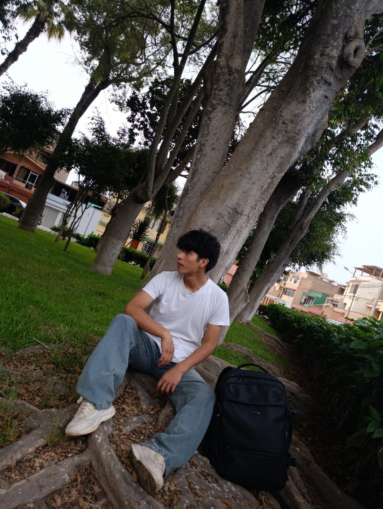
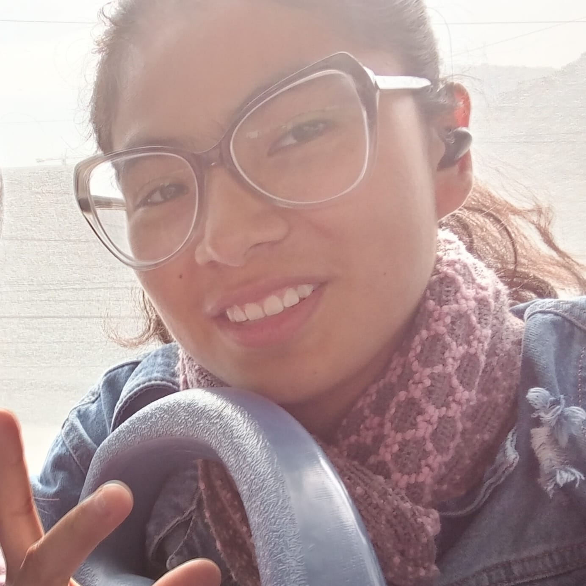
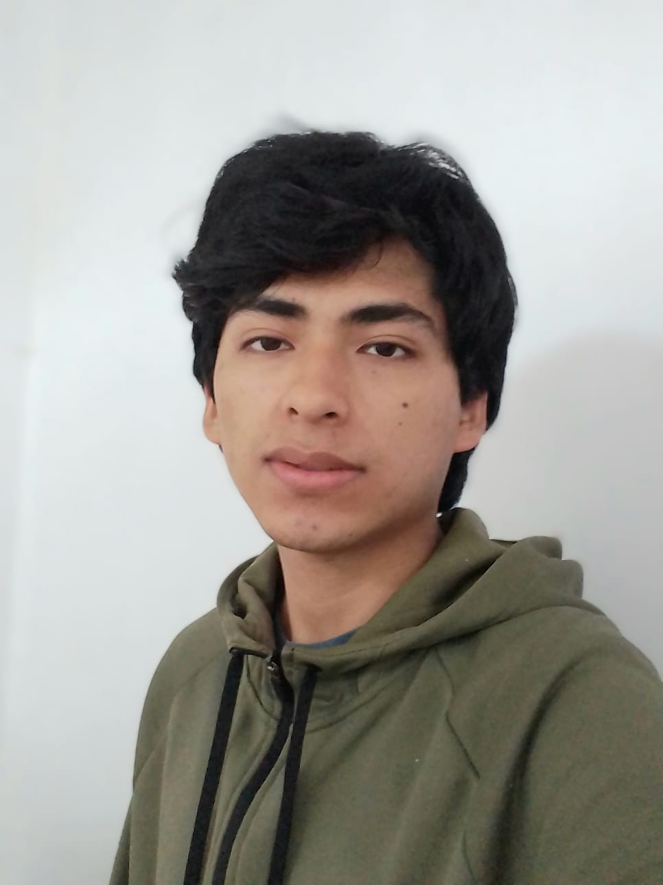

<!-- Encabezado -->
<h1 align="center">Equipo 11 — Fundamentos de Diseño 2026-1</h1>

---

## Descripcion Carrera de Ingeniería Ambiental / Informática / Industrial
   Universidad Peruana Cayetano Heredia

---

## 🧭 Descripción

Somos el Equipo 11 del curso Fundamentos de Diseño 2026-1, integrado por estudiantes de las carreras de Ingeniería Ambiental, Ingeniería Informática e Ingeniería Industrial.

Nuestro propósito es aplicar la metodología de diseño centrado en las personas para desarrollar soluciones innovadoras que respondan a problemáticas actuales relacionadas con la sostenibilidad, la tecnología y el bienestar social.

En el desarrollo de este proyecto proponemos explorar soluciones basadas en sistemas de hidroponía vertical para hogares, con el objetivo de promover nuevas formas de producción de alimentos en entornos urbanos. Esta propuesta busca aprovechar la tecnología, el diseño sostenible y la optimización de recursos para facilitar el cultivo de alimentos frescos en espacios reducidos, contribuyendo así a mejorar la seguridad alimentaria, el uso eficiente del agua y la sostenibilidad de las ciudades.

Además, el proyecto plantea la integración de herramientas tecnológicas como sensores, monitoreo digital y automatización, que permitan optimizar el crecimiento de los cultivos y mejorar la eficiencia del sistema. De esta manera, se busca combinar conocimientos de ingeniería ambiental, informática e industrial para diseñar una solución innovadora que pueda aplicarse tanto a nivel doméstico como en futuros sistemas de agricultura urbana a mayor escala.

---

## 🌍 Objetivos de Desarrollo Sostenible relacionados

- 🏙️ **ODS 11:** Ciudades y Comunidades Sostenibles  
  Este proyecto busca abordar el desafío de la producción y acceso a alimentos en las ciudades. Actualmente, más del **55% de la población mundial vive en zonas urbanas**, y se proyecta que para el **año 2050 esta cifra alcance aproximadamente el 68%**. Este crecimiento genera una mayor presión sobre los sistemas de abastecimiento de alimentos, ya que gran parte de la producción agrícola se encuentra en zonas rurales alejadas de los centros urbanos.  
  La hidroponía vertical surge como una alternativa innovadora para producir alimentos dentro de las ciudades utilizando espacios reducidos como hogares, balcones o edificios. Además, permite cultivar alimentos frescos cerca del lugar de consumo, reduciendo el transporte, los costos logísticos y el impacto ambiental. A largo plazo, este tipo de soluciones puede contribuir al desarrollo de ciudades más resilientes, sostenibles y capaces de producir parte de sus propios alimentos.

- ❤️ **ODS 3:** Salud y Bienestar  
  La alimentación saludable es un factor clave para mantener una buena calidad de vida. Sin embargo, en muchas ciudades el acceso a alimentos frescos y nutritivos puede ser limitado debido a factores como el costo, la disponibilidad o la dependencia de cadenas de suministro externas.  
  El desarrollo de sistemas de cultivo doméstico como la hidroponía vertical permite a las personas producir alimentos frescos directamente en sus hogares, como verduras y hortalizas. Esto puede incentivar hábitos alimenticios más saludables y aumentar el consumo de productos naturales. Además, el cultivo sin pesticidas químicos contribuye a una alimentación más segura y a una mejora general del bienestar de la población.

- 💧 **ODS 6:** Agua Limpia y Saneamiento  
  El uso eficiente del agua es uno de los grandes desafíos de la agricultura actual. La agricultura tradicional utiliza aproximadamente el **70% del agua dulce disponible en el mundo**, lo que representa una presión importante sobre los recursos hídricos.  
  Los sistemas hidropónicos presentan una ventaja importante, ya que pueden utilizar **hasta un 90% menos agua** que los métodos agrícolas convencionales. Esto es posible porque el agua circula dentro de un sistema cerrado donde puede reutilizarse varias veces, reduciendo el desperdicio. En este proyecto, el uso de hidroponía vertical busca demostrar cómo es posible producir alimentos utilizando menos agua y promoviendo prácticas agrícolas más sostenibles.

- 🏗️ **ODS 9:** Industria, Innovación e Infraestructura  
  La innovación tecnológica juega un papel fundamental en el desarrollo de nuevas soluciones para los desafíos actuales. Este proyecto propone integrar tecnología al sistema de cultivo mediante el uso de sensores, microcontroladores y sistemas de monitoreo digital que permitan controlar variables como temperatura, humedad, iluminación y nivel de agua.  
  La incorporación de herramientas tecnológicas permite optimizar el crecimiento de las plantas, mejorar la eficiencia del sistema y facilitar el monitoreo del cultivo. De esta manera, el proyecto no solo propone una solución ambiental, sino también una aplicación de la tecnología para modernizar los sistemas de producción de alimentos en entornos urbanos.

- 🌱 **ODS 13:** Acción por el Clima  
  Los sistemas alimentarios actuales tienen un impacto significativo en el medio ambiente. El transporte de alimentos desde zonas rurales hasta las ciudades genera emisiones de gases de efecto invernadero, contribuyendo al cambio climático.  
  La producción local de alimentos mediante hidroponía urbana puede reducir la necesidad de transporte y disminuir la huella de carbono asociada al consumo de alimentos. Además, el uso eficiente del agua, la posibilidad de integrar energías renovables y la reducción del uso de suelo agrícola convierten a la hidroponía vertical en una alternativa sostenible frente a los retos ambientales actuales.

Estos objetivos guían el desarrollo del proyecto, buscando soluciones que contribuyan a una **sociedad más sostenible, saludable y darle un mejor futuro a las personas**.

---

## 📸 Fotografía del Equipo

---

## 👥 Integrantes del Equipo

| Foto | Nombre | Rol | Intereses |
|-----|-----|-----|-----|
|  | **Ximena** | Líder del equipo | Innovación social, sostenibilidad |
|  | **Romero Chac Luis** | Responsable de investigación | análisis de datos, soluciones tecnológicas |
|  | **Chavez Orihuela Isai** |Gestión económica | Desarrollo sostenible,Generar beneficios|
|  | **Cielo Durand Romero** |Diseño de prototipos | Desarrollo sosteniblecreatividad aplicada|
|  | **Piero Romero Meza** |Modelación de recursos | Innovación e infraestructura|

---

## 📝 Resumen

Nuestro equipo busca plantear proyectos que combinen **tecnología, sostenibilidad y diseño** enfocado en las **personas y la comunidad**, con el propósito de **ofrecer respuestas a problemáticas existentes tanto en nuestro país como en otras regiones del mundo**. Estas iniciativas estarán alineadas con los ODS de las Naciones Unidas, aportando al desarrollo de soluciones innovadoras y sostenibles.

---
