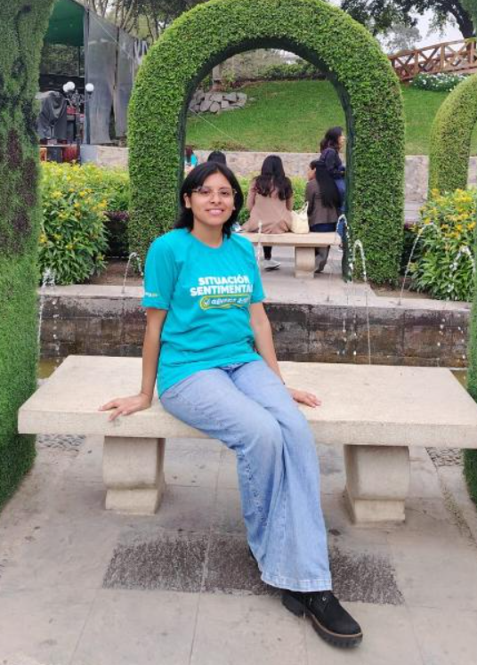

<!-- Encabezado -->
<h1 align="center">Equipo 11 — Fundamentos de Diseño 2026-1</h1>

---

## DescripCarrera de Ingeniería Ambiental / Informática / Industrial
   Universidad Peruana Cayetano Herediación

---

## 🧭 Descripción

Somos el **Equipo 11** del curso **Fundamentos de Diseño 2026-1**, integrado por estudiantes de las carreras de **Ingeniería Ambiental, Ingeniería Informática e Ingeniería Industrial**.

Nuestro propósito es **aplicar la metodología de diseño** para desarrollar soluciones innovadoras que generen un impacto positivo en los ámbitos **social, tecnológico y ambiental**.

En este proyecto buscamos enfocar nuestras propuestas en los siguientes **Objetivos de Desarrollo Sostenible (ODS)**.

---

## 🌍 Objetivos de Desarrollo Sostenible relacionados

- ❤️ **ODS 3:** Salud y Bienestar  
- 💧 **ODS 6:** Agua Limpia y Saneamiento  
- 🏗️ **ODS 9:** Industria, Innovación e Infraestructura  
- 🏙️ **ODS 11:** Ciudades y Comunidades Sostenibles  
- 🌱 **ODS 13:** Acción por el Clima  

Estos objetivos guían el desarrollo del proyecto, buscando soluciones que contribuyan a una **sociedad más sostenible, saludable y resiliente**.

---

## 📸 Fotografía del Equipo

---

## 👥 Integrantes del Equipo

| Foto | Nombre | Rol | Intereses |
|-----|-----|-----|-----|
|  | **Ximena** | Líder del equipo | Innovación social, sostenibilidad |
|  | **Romero Chac Luis** | Responsable de investigación | Gestión ambiental, desarrollo comunitario |
|  | **Chavez Orihuela Isai** |Gestión económica, desarrollo sostenible|

---

## 📝 Resumen

uestro grupo busca plantear proyectos que combinen **tecnología, sostenibilidad y diseño** enfocado en las **personas y la comunidad**, con el propósito de **ofrecer respuestas a problemáticas existentes tanto en nuestro país como en otras regiones del mundo**. Estas iniciativas estarán alineadas con los ODS de las Naciones Unidas, aportando al desarrollo de soluciones innovadoras y sostenibles.

---